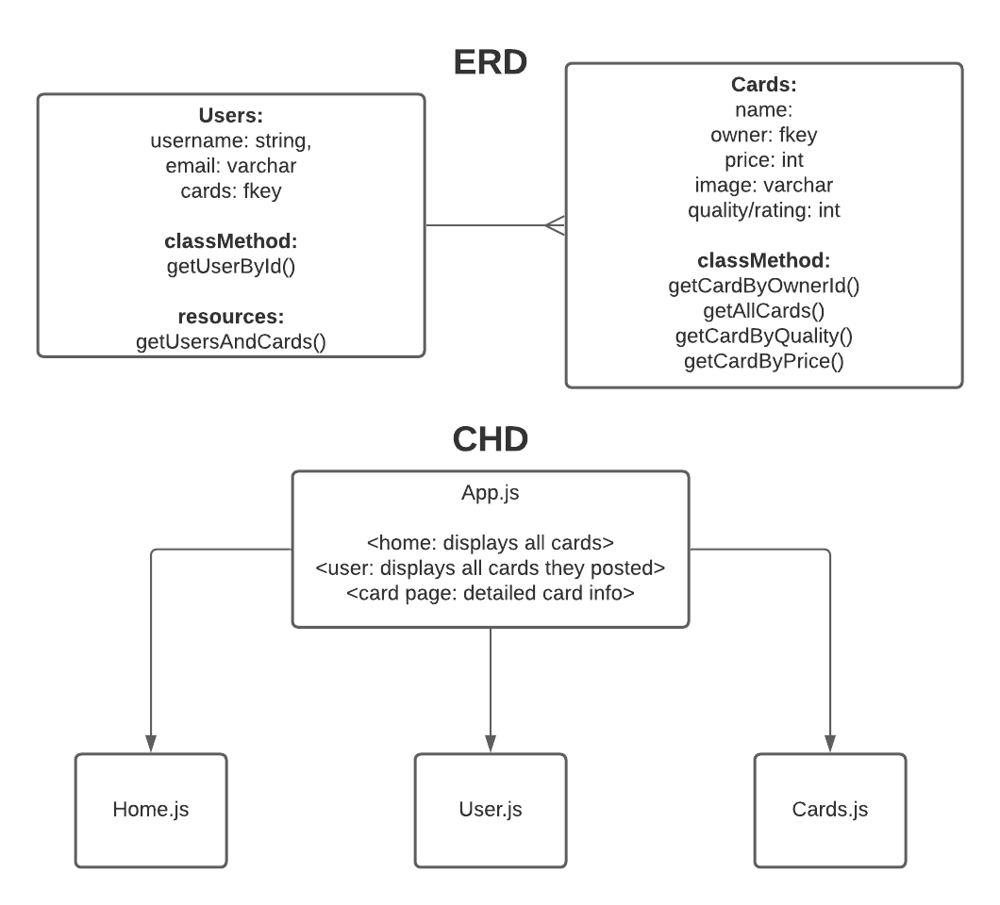

# Rare Pokedex
## 08 Jul 2021

## Created & Coded By:
[Brady Roscher](https://www.linkedin.com/in/brady-roscher-291521212/) | [Bailey Leavitt](https://www.linkedin.com/in/baileyleavitt/)

## Description
Since its inception in the mid 1990s, Pokemon has only grown in popularity. This app offers a one-stop shop for only the RAREST of Pokemon cards.

## Tech Used
PostgreSQL | Flask | Python | React.js | Javascript (ES6) | HTML5 | CSS3

## Getting Started

## Game Design

## Requirements
- Get (Read)
- Post (Create)
- Delete (Delete)
- Flask Postgres backend
- Working React frontend
- Reasonably styled

## Credits
- [The Gamer - Rarest Pokemon Cards](https://www.thegamer.com/rarest-pokemon-cards-worth/)
- [CSS Workshop - Image with Text Overlay Guide](http://css-workshop.com/hover-box-text-over-images-on-hover-and-more/)
